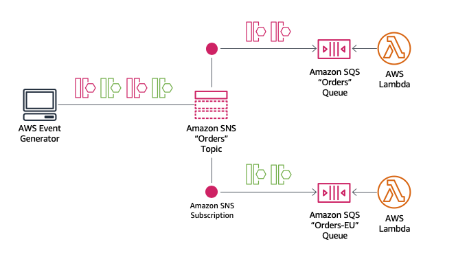
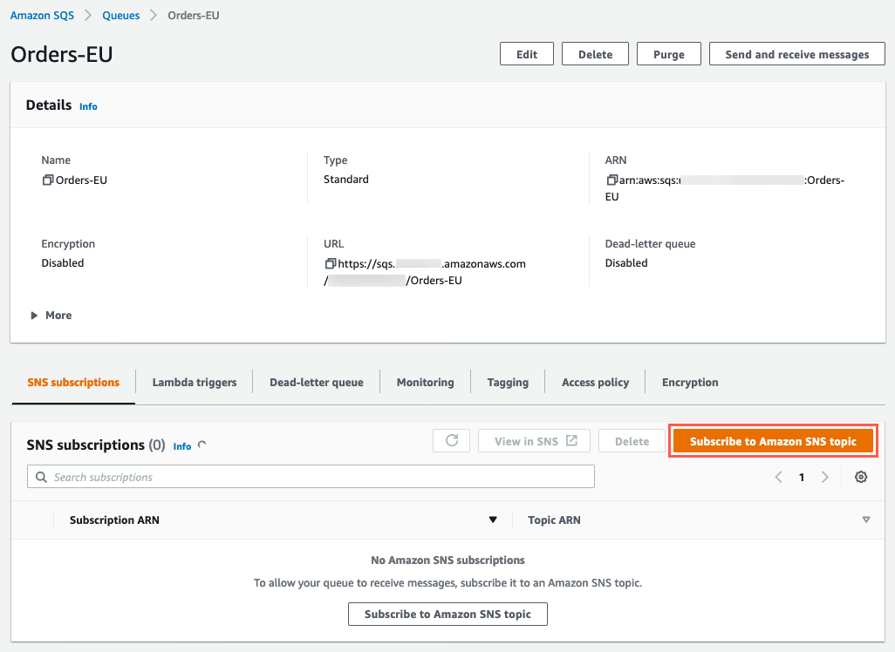
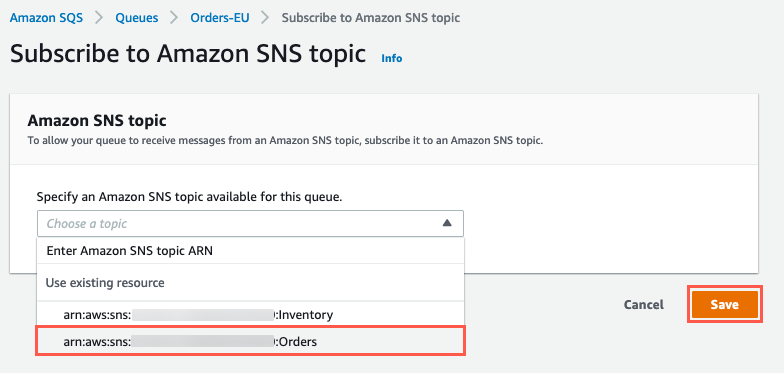
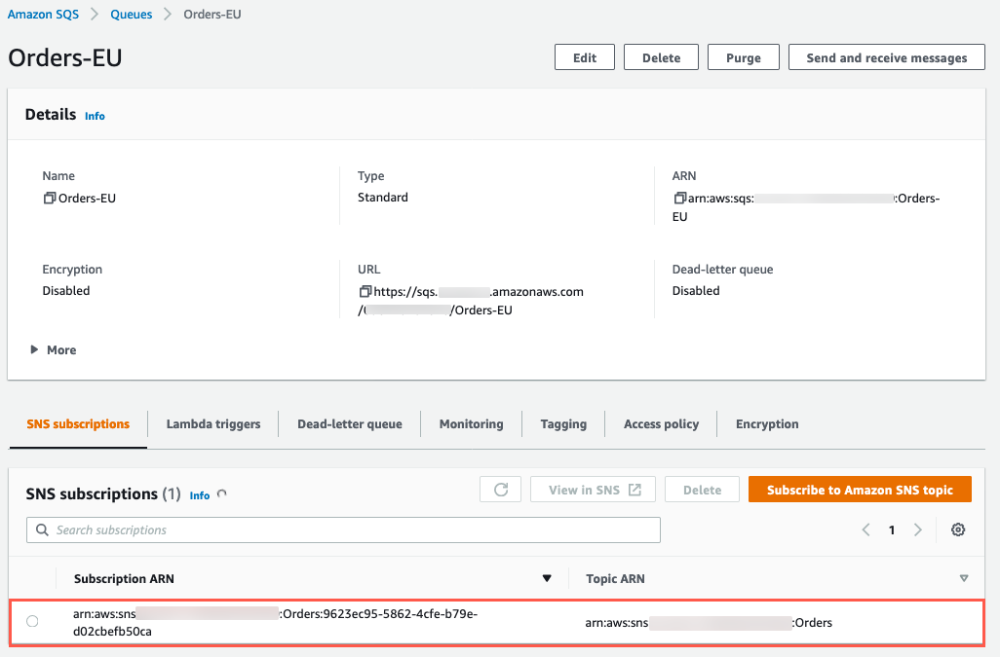
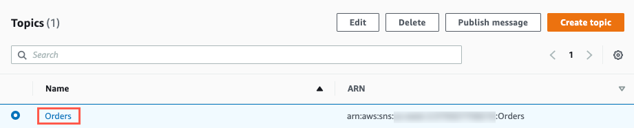
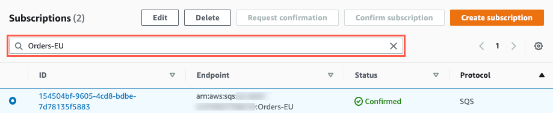
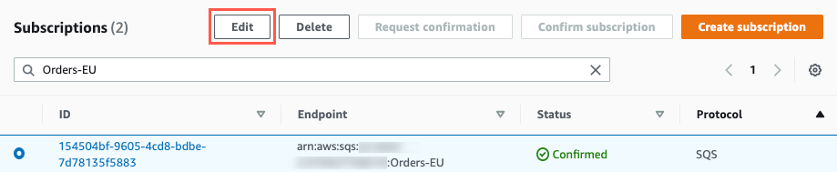
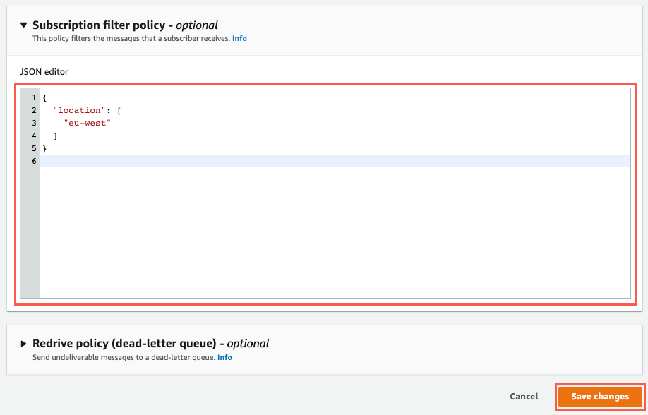
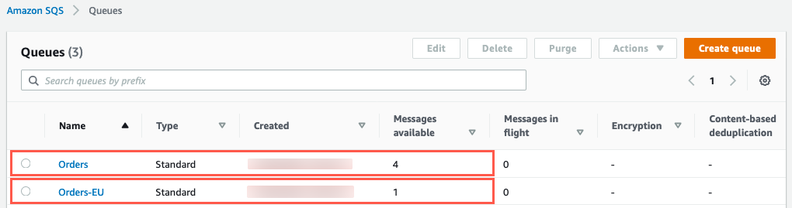

## MESSAGE FILTERING

**What is Amazon SNS Message Filtering?**
       
   

  - By default, an Amazon SNS topic subscriber receives every message published to the topic. To receive a subset of the messages, a subscriber must assign a filter policy to the topic subscription. A filter policy is a simple JSON object containing attributes that define which messages the subscriber receives.

  - When you publish a message to a topic, Amazon SNS compares the message attributes to the attributes in the filter policy for each of the topic’s subscriptions. If any of the attributes match, Amazon SNS sends the message to the subscriber. Otherwise, Amazon SNS skips the subscriber without sending the message.

  - You can simplify your use of Amazon SNS by consolidating your message filtering criteria into your topic subscriptions. This allows you to offload the message filtering logic from subscribers and the message routing logic from publishers, eliminating the need to filter messages by creating a separate topic for each condition. You can use a single topic, differentiating your messages using attributes. Each subscriber receives and processes only the messages accepted by its filter policy.

  - In this section, you will create a new SQS queue for EU Orders, and create a subscription to the Orders SNS topic with a filter policy to route each message to the EU Orders SQS queue. To indicate EU Orders, you will assign an attribute, location, with a value eu-west to the message.

  - First, create a new SQS queue for EU Orders.
    
    **Step 1: Create the Orders-EU SQS queue**

       1. Create an Amazon SQS queue, called Orders-EU, to durably store EU Order messages.

       2. Open the AWS Management Console for SQS  in a new tab or window, so you can keep this step-by-step guide open.

       3. Choose Create queue at the top of your queue list.

       4. Select Standard for the type of queue you want to configure.

       5. Enter Orders-EU as the queue Name.

       6. Use the default values for the other configurations and choose Create queue

    **Step 2: Subscribe the Orders-EU SQS Queue to the Orders SNS Topic**

       1. On the Queue detail page, select Subscribe to Amazon SNS topic.

            

       2. Select the topic that ends with Orders and choose Save. 

            

       3. Verify that the queue is subscribed to the topic.

            

    **Step 3: Create EU Orders subscription filter policy**

       1. Open the AWS Management Console for SNS  in a new tab or window, so you can keep this step-by-step guide open.

       2. From the list of topics, choose the Orders topic. 

            

       3. In the Subscriptions search box, enter Orders-EU to find the Orders-EU SQS queue subscription.

            

       4. Select the Orders-EU subscription and then choose Edit.

            

       5. On the Edit subscription page, expand the Subscription filter policy section.

       6. In the JSON editor field, paste the following filter policy into the JSON editor. Remember to use the Copy to clipboard icon in the upper-right corner.

               {
              "location": [
                "eu-west"
              ]
              }

       7. Choose Save changes.

            

    **Step 4: Publish test messages**

       Time to test the configuration, we will publish 4 different types of messages

       1. Message 1: No message attributes

          - Choose Publish to publish the message to the Orders SNS topic.

       2. Message 2: Non-present message attributes

          - Choose Add attribute to add a message attributes.

          - For the attribute Type, leave the selection as String. For the attribute Name, enter category. For the attribute Value, enter books.

          - Choose Publish to publish the message to the Orders SNS topic.

       3. Message 3: Non-matching message attributes

          - For the attribute Type, leave the selection as String. For the attribute Name, enter location. For the attribute Value, enter us-west.

          - Choose Publish to publish the message to the Orders SNS topic.

       4. Message 4: Matching message attributes

          - For the attribute Type, leave the selection as String. For the attribute Name, enter location. For the attribute Value, enter eu-west.

          - Choose Publish to publish the message to the Orders SNS topic.

    **Step 5: Verify message delivery**

       1. Open the AWS Management Console for SQS  in a new tab or window, so you can keep this step-by-step guide open.

       2. Note that the Orders queue shows 4 messages delivered and the Orders-EU queue only shows 1 message delivered.

            

       This is because only Message 4 had the matching message attribute key and value (location = eu-west) to satisfy the subscription filter.
